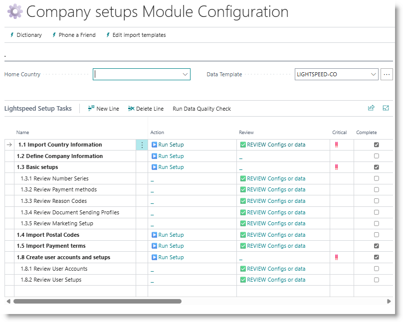

# Company-wide Setups
This section covers basic setups that are used throughout Business Central, and will be needed in module-specific configurations.

From the Home page, click on 'Company Setups'

Work through the actions from top to bottom. The ‼️ symbol indicates that the step is compulsory, and that it must be done before subsequent steps can be handled.

## Import Country Information
Country codes are used as part of addresses in various entries in Business Central. 
To load country information, click on 'Run Setup' on the 'Import Country Information'. 
On the popup, choose an option, then click on OK.

**JSON:** uses a built-in setup, containing country codes, names, currency codes and stanadard VAT rates.
**Web Service** loads from an external web service.
**Excel** allows the user to select an Excel sheet to load countries from.

>The recomended option is JSON.