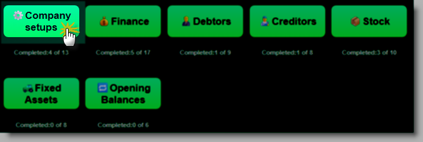
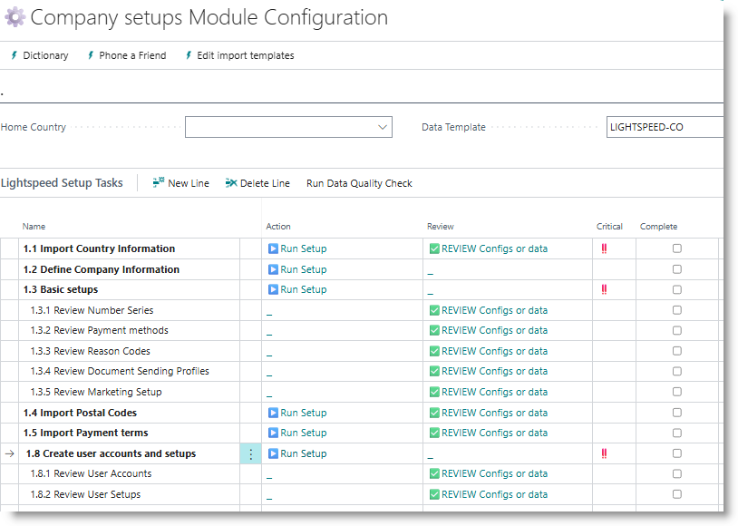
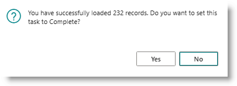
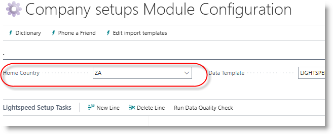
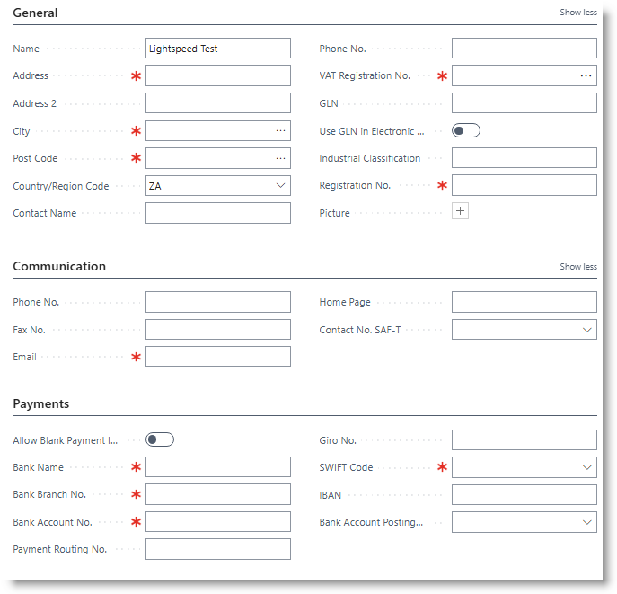
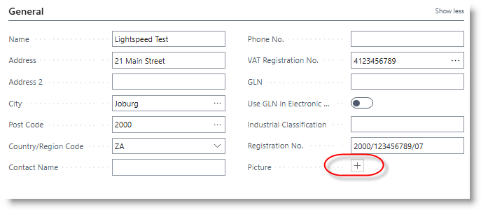
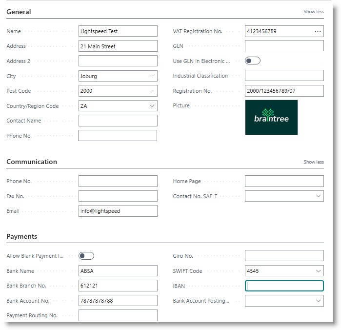
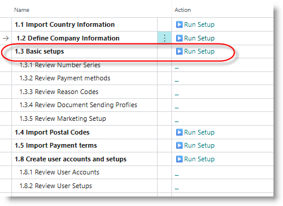
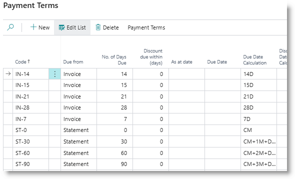

# Company-wide Configuration
This section covers basic setups that are used throughout Business Central, and will be needed in module-specific configurations.

From the Home page, click on 'Company Setups'

The following screen will open: 

Work through the actions from top to bottom. The ‼️ symbol indicates that the step is compulsory, and that it must be done before subsequent steps can be handled.

- [Import Country Information](#import-country-information)
- [Run Basic Setups](#basic-setups)
- [Update Company Information]()
- [Load Postal Codes](#import-postal-codes)
- [Create Payment Terms](#create-payment-terms)
- [Create User Accounts and Setups](#create-user-accounts-and-setups)

## Import Country Information
Country codes are used as part of addresses in various entries in Business Central. 
>This is a compulsory step
To load country information, click on 'Run Setup' on the 'Import Country Information'. 
On the popup, choose an option, then click on OK.

**JSON:** uses a built-in setup, containing country codes, names, currency codes and stanadard VAT rates.
**Web Service** loads from an external web service.
**Excel** allows the user to select an Excel sheet to load countries from.

>The recomended option is JSON.

After countries have been loaded, a confirmation dialog will be displayed. Click on Yes:

The home country code will be inserted into the Home Country field on the setup page.

## Review information
Click on 'REVIEW configs or data'. The list of countries will be displayed. You can edit, add or delete records are required. The 'Complete' tick box for the task will be ticked on.

## Define Company Information
This step allows you to capture key information about your company. Click on 'Run Setup'.

Fields indicated with a red ✱ are compulsory fields, and need to be captured before the task is considered to be complete.

After completing all fields, load the company logo into the Picture field, by click on the '+' symbol:

The completed screen should look something like this:

Close the page.

## Basic Setups
This steps carries out a number of actions in one go. Click on 'Run Setup':
>This is a compulsory step

This will complete the following steps:
- Create number series
- Create payment methods
- Create Reason codes
- Create document sending profiles
- Create marketing setup

After running the Setup, click on REVIEW against each substep to check the details.

## Import Postal Codes
This step loads South African postal codes. The step provides two options:
- JSON: import from the JSON file which is packaged with Lightspeed.
- Excel: import via an Excel sheet.

>Recommendation: Use the built-in JSON file.

Click on Run Setup, and follow the prompts.  After the import is completed, you can click on '✅ REVIEW Configs or Data' to examine or edit the postal codes.

## Create Payment Terms
Payment terms are used in the Debtors and Creditors modules to calculate due dates on invoices. A sample set of payment terms can be loaded, and thereafter edited 
A sample of commonly used payment terms is deployed when Lightspeed is installed.

Click on '▶️Run Setup' for the task. When complete, click on '✅REVIEW Configs or data'.

### Add a new code
To add a new code, go to a blank line, and capture a payment terms code of up to 10 alpha-numeric characters. Then capture fetails as follows:

| **Field name**        | **Entry** |
| Due from              | Enter 'Statement' to calculate payment due dates from date of statement,|
|                       | Enter 'Invoice' to calculate payment due dates from date of invoice  |
| No. of days due       | Enter the number of payment days allowed. |
| Discount due within   | If you allow customers to claim settlement discount, enter the number of days within which payment must be made |
| Discount %            | The percentage discount claimable if payment is made within the discount terms|

## Create User Accounts and Setups
Users are granted access to Business Central by associating their organisation login or email with a Business Central licence. This is usually done by a system administrator. In addition to the user account, there may be other settings that need to be configured around your business rules, for example allowable posting dates.

From the Company setup, click on **▶️Run Setup** for the task 'Create user accounts and setups'. The system will create a user setup for each licensed user.

Click on the REVIEW option for User Accounts or User Setups, to review user information.

---
[**⬆️ Back to Top**](#initial-questionaire) &nbsp;&nbsp;&nbsp;&nbsp; [**🏠 Home**](/Lightspeed-Support)
