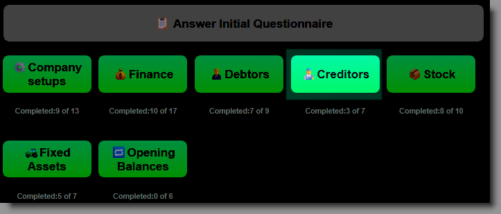
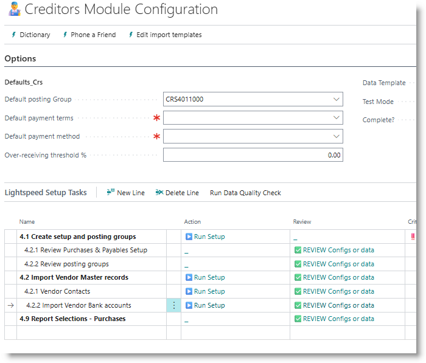
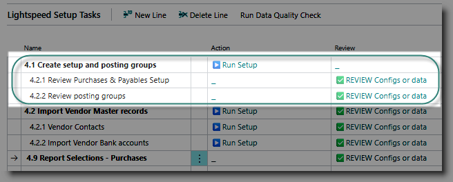
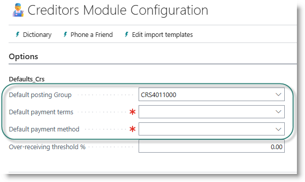
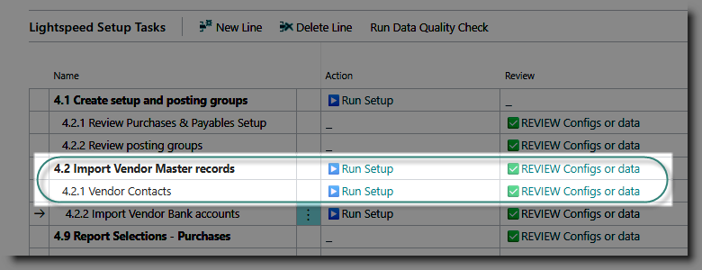

# Creditors / Purchases and Payables Module
Use this section to configure the Purchases and Payables module of Business Central.
Start by clicking on Creditors from the Home page:

## Create setup and posting groups
This is a priority task, which must be done before other tasks are attempted.

Click on '▶️Run Setup' for the task 'Create Setup and posting groups'.
This will update the Purchases and Payables setup table with commonly used settings, and assign the document number series.

It will also create Vendor Posting Groups, which are used to connect the creditors subledger to the general ledger creditors control accounts.  
A posting group will be created for each general ledger account designated with the key account usage 'CREDITORS'.

To review the Purchases and Payables setup, click on '✅REVIEW' on the task 'Review Purchases and Payables'. 

To review the posting groups, click on '✅REVIEW' on the task 'Review posting groups.

After running the setups, the first Vendor posting group will be inserted in the page header, in the 'Default Posting Group' field. This will be used to set the customer posting group when importing accounts from Excel. You can amend this if required.

## Vendor Master
Supplier master data is loaded via an Excel template. Along with the supplier details, a default vendor bank account and primary contact are created.

Before importing vendors, select a default payment terms code and payment method code, and check that the default posting group is correct:

**Import from Excel**

- Click on '▶️Run Setup' for the task 'Import Vendor master records'. 
- Click on 'Export Template' to create an empty Excel Sheet.
- Populate the sheet with the supplier information and bank details, and save the file.
- Click on '▶️Run Setup' again, and this time, select 'Import Data'.

The standard data template includes the following fields (click for details):

        - Vendor number
        - Name
        - Address
        - Phone number
        - Email address
        - Credit limit
        - Co. Registration and VAT registration numbers,
        - Payment terms
        - Bank account number
        - Bank branch number

When the import is complete, a dialog will be displayed:

>[How to review data errors](../General/ErrorCorrections.md)

**Review Supplier Details**
To review and edit supplier details, click on '✅REVIEW'. The Vendor list will open. You can edit details on this page if required, or you can open the Item Card by clicking on the Edit action in the menu bar.

**Review Bank Accounts**
To review vendor bank accounts, click on '✅REVIEW' on the 'Import Vendor bank accounts' task. You can now edit or add bank accounts.

## Contacts
When you import suppliers, a primary contact will be created for each new supplier. You can review them by clicking on '✅REVIEW' on the vendor contacts task.  You can also load additional contacts, by following a similar process to the import for customers:

- Click  '▶️Run Setup'
- Export template
- Populate template
- Click '▶️Run Setup'
- Import from template

## Report Selections
If you want to change the default document layout selection for purchase orders, click on '✅REVIEW' on the 'Report Selections - Sales task'.

[**⬆️ Back to Top**](#creditors--purchases-and-payables-module) &nbsp;&nbsp;&nbsp;&nbsp; [**🏠 Home**](/Lightspeed-Support)