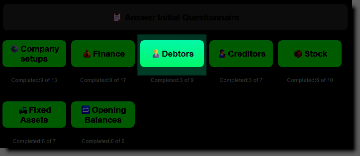
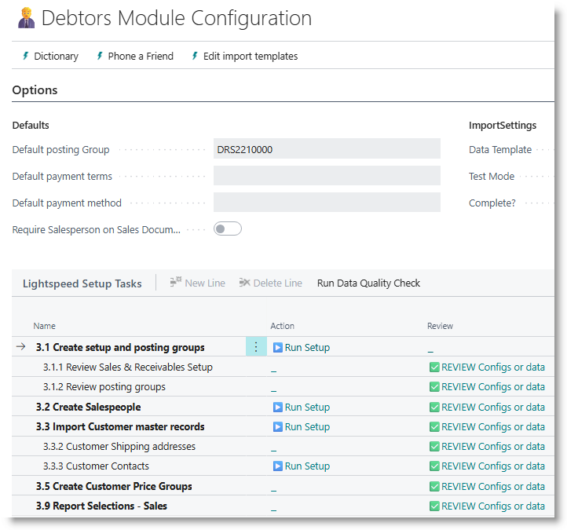
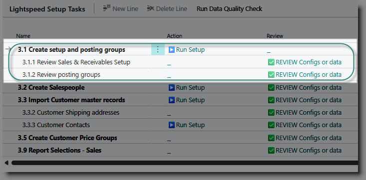
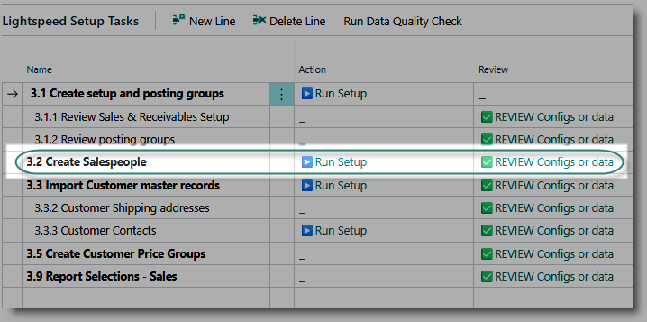
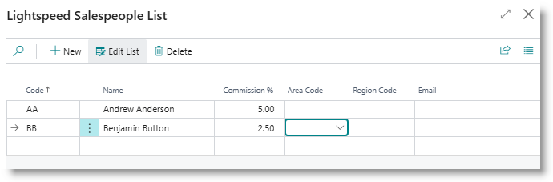
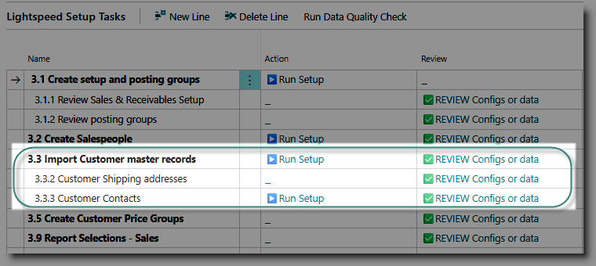

# Debtors / Sales and Receivables Module
Use this section to configure the Sales and Receivables module of Business Central.
Start by clicking on Debtors from the Home page:

 

## Create setup and posting groups
This is a priority task, which must be done before other tasks are attempted.

Click on '▶️Run Setup' for the task 'Create Setup and posting groups'.
This will update the Sales and Receivables setup table with commonly used settings, and assign the document numbers.

It will also create Customer Posting Groups, which are used to connect the debtors subledger to the general ledger debtors control accounts.  
A posting group will be created for each general ledger account designated with the key account usage 'DEBTORS'.

To review the Sales and Receivables setup, click on '✅REVIEW' on the task 'Review Sales & Receivables Setup'. 

To review the posting groups, click on '✅REVIEW' on the task 'Review posting groups.

## Salespeople
If your business keeps track of revenue for salespeople, you can import salespeople from an Excel sheet, or capture the salespeople directly into the system.

**Import from Excel**
- Click on '▶️Run Setup' for the task 'Create Salespeople'. 
- Click on 'Export Template' to create an empty Excel Sheet.
- Populate the sheet with the salespeople details, and save the file.
- Click on '▶️Run Setup' again, and this time, select 'Import Data'.

**Review and Edit Salespeople**  
Click on '✅REVIEW' for the task 'Import Salespeople'.
If you have imported Salespeople from Excel, the imported details will be displayed, and can be updated if required.

## Customer Master
Customer master data is loaded via an Excel template. Along with the customer details, a default delivery address and primary contact are created.

**Import from Excel**
- Click on '▶️Run Setup' for the task 'Import Customer master records'. 
- Click on 'Export Template' to create an empty Excel Sheet.
- Populate the sheet with the customer information and delivery details, and save the file.
- Click on '▶️Run Setup' again, and this time, select 'Import Data'.

The standard data template includes the following fields  (click for details)

<ul>
        - Customer number
        - Name
        - Address
        - Phone number
        - Email address
        - Credit limit
        - Co. Registration and VAT registration numbers,
        - Payment terms
        - Delivery address
<!-- <li>Line 2 of detail</li>  -->
<!-- copy line above to add details -->
</ul>

The standard data template includes the following fields (click for details):
        The standard data template includes the following fields:
        - Customer number
        - Name
        - Address
        - Phone number
        - Email address
        - Credit limit
        - Co. Registration and VAT registration numbers,
        - Payment terms
        - Delivery address

## Contacts

## Customer Price Groups

## Report Selections

[**⬆️ Back to Top**](#initial-questionaire) &nbsp;&nbsp;&nbsp;&nbsp; [**🏠 Home**](/Lightspeed-Support)