# Finance Module Configuration

## Overview
The Finance Module Configuration sets up Business Central for processing of basic financial information, including General Ledger entries and cash entries.

- [Create Fiscal Years](#accounting-periods-and-fiscal-years)
- [General Ledger Accounts](#general-ledger-accounts)
- [Dimensions](#dimensions)
- [Bank accounts](#bank-accounts)
- [Currencies and Exchange Rates](#currencies-and-exchange-rates)
- [Posting Groups and Setups](#posting-groups-and-setups)

Click on the 'Finance' button on the home page.

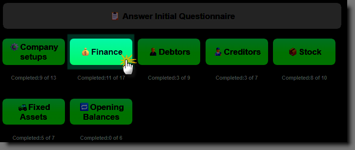

- Double check that the correct financial year end period has been selected. 
- Check and update the number of financial years you want to create.
  >Select at least 3 years.
- Check that the standard VAT rate is set correctly (this should have been configured from previous steps).
- Verify the number of bank accounts that you would like to create.

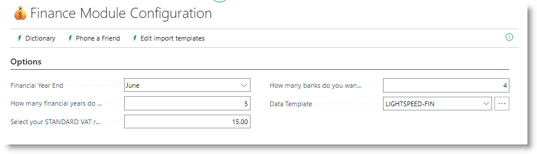

## Accounting Periods and Fiscal Years
Accounting periods, also known as reporting periods, are periods of time for which a company or organization reports financial performance by generating, for example, their income statement or balance sheet. Financial periods are grouped into Fiscal years, corresponding to the financial reporting year of the business.

Click on '▶️Run Setup' next to the step 'Setup GL and Accounting Periods'. This step will set up the basic general ledger parameters, and generate accounting periods for the number of financial years you requested. The system will create  the prior financial year, the current financial year, and one or more future years.

After the step has been completed, click on '✅REVIEW' for the steps 'Review GL Setup' and 'Review Accounting Periods' to verify the setups. The 'Complete' tick mark for all three steps should be ticked off.

>[How to work with financial periods](https://learn.microsoft.com/en-us/dynamics365/business-central/finance-accounting-periods-and-fiscal-years)

## General Ledger Accounts
General ledger acocunts are created to manage the business's financial administration. A standard chart of accounts is available to get started, or you can load your own chart of accounts.

### Option 1: Load the standard chart of accounts
Click on '▶️Run Setup' for the General Ledger Accounts step. From the dialog, click on 'Import JSON Example', then click on OK.

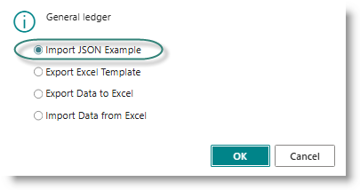

The sample chart of accounts will be loaded.

### Option 2: Load from Excel
A customer chart of accounts can be created from Excel. This is a multistep process:
- Export template to Excel
- Populate template in Excel
- Import populated Excel template.

#### Export template
Click on '▶️Run Setup' for the General Ledger Accounts step. From the dialog, click on 'Export Excel Template' then click on OK:

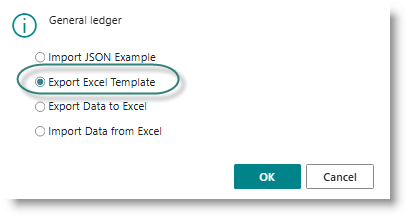

Open the downloaded template:

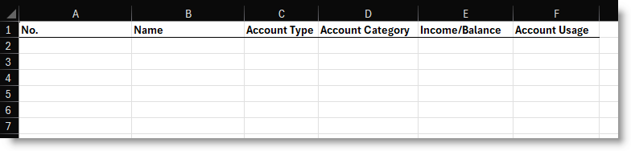

#### Complete the template as follows:

| Column            | Value                                     |
|No.                |Enter the general ledger account number    |
|Name               |Enter the description of the account       |
|Account Type       |Enter Begin-total, Posting, or End-Total   |
|Account Category   |                                           |
|Income / Balance   |Enter 'Income Statement' or 'Balance Sheet  |
|Account usage      |Accounts associated with subledgers (eg Debtors Control) should be categorised with one of the values in the sheet 'FastTrack Key Acct Usage' |

#### Review GL Accounts
After loading the chart of accounts, click on **✅REVIEW** to view the account details. You can edit information on the accounts from this page.

## Dimensions
Dimensions are values that categorize entries so you can track and analyze them on documents, such as sales orders. Some commonly used dimensions are available for you to choose from when you install the FastTrack extension.

Click on '▶️Run Setup' on the 'Suggest / Create Dimensions' task. The list of predefined options will be displayed:

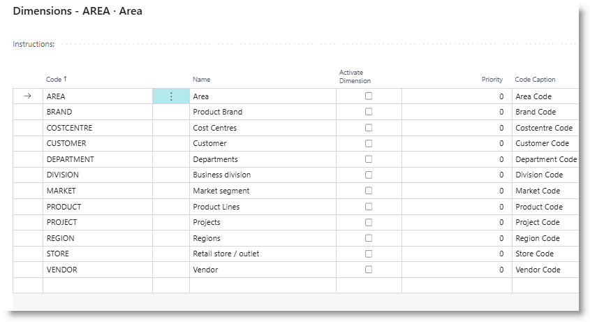

If you need a dimension which is not listed, go to the empty line at the bottom of the page, and insert the new code.

Identify the dimensions you want to use, then, in sequence of priority, tick on the column 'Activate Dimension'. The priority column will be updated with a number starting at 1, and incrementing by 1 for each dimension you turn on. In the example below, Division will become the Global Dimension 1, Region becomes global dimension 2, and Market becomes dimension 3. 

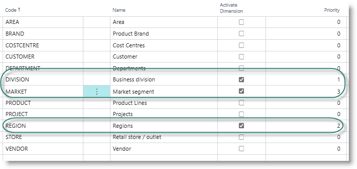

When you are happy with your choices, click on OK to complete the process. When complete, the dialog will be displayed:

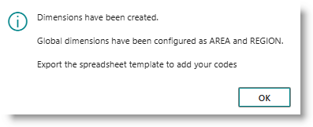

For more information on how dimensions are used in Business Central, follow the link below:

[Learn more about dimensions](https://learn.microsoft.com/en-us/dynamics365/business-central/finance-dimensions)

## Bank Accounts
In Business Central, banking entries are run via the bank subledger. Each bank account that the business operates should be created in Business Central.

### Banking institutions
On installation, FastTrack will create a list of the major banking institutions in use in South Africa, together with their universal branch code and Swift code. These can be used to associate your business bank accounts with the appropriate codes. You can add or edit the list by clicking on ''✅REVIEW' on the task 'Review Banking Institutions' 

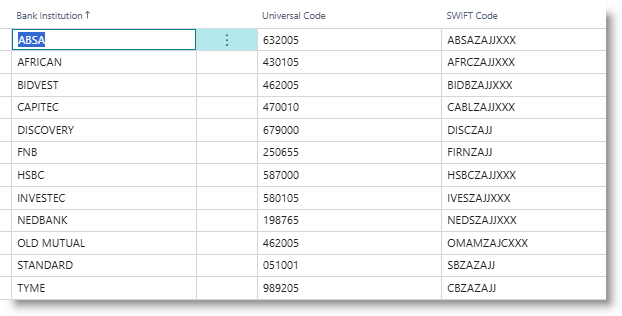

### Creating Bank accounts
Check the number of bank accounts being requested on the Finance Module Configuraiton page:

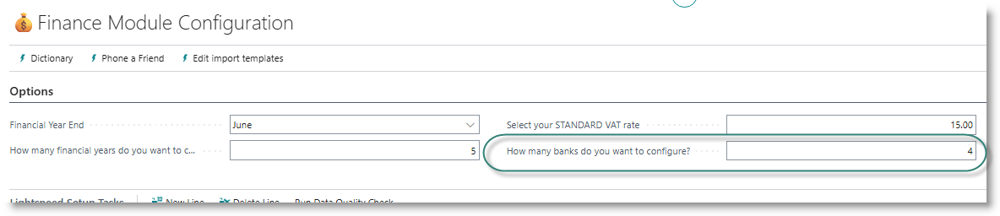

Click on '▶️Run Setup' on the 'Create Bank accounts' task. The bank accounts and their associated posting groups will be created. When the step is complete, the dialog will be displayed:

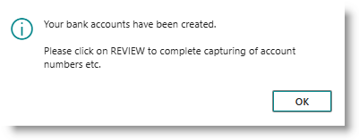

Click on '✅REVIEW'. The bank accounts will be displayed, for you to complete remaining details:

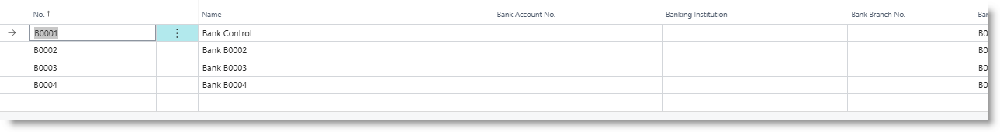

For each account, enter the business's account number with the bank, and select the appropriate institution. The branch number and swift code will be completed.

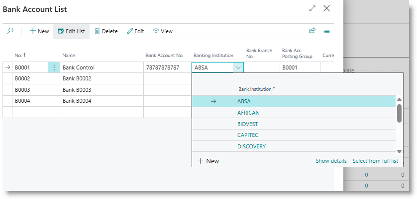

## Currencies and Exchange Rates
Currencies are automatically created when the countries are created. All that remains is to update with the correct general ledger account numbers (for posting exchange rate profit/loss), and to set the exchange rates.

Click on '▶️Run Setup'. This will insert the GL acocunt designated with the usage code 'CURR' into the currency records. Click on '✅REVIEW' to check the results and update exchange rates.

## Posting Groups and Setups
General posting setups and VAT setups are used to post trading-related transactions such as sales from subledgers to general ledger, and to manage VAT postings.

Click on '▶️Run Setup' to run the step, then click on '✅REVIEW' on 'Review General posting setups' and 'Review VAT posting setups' to review the accounts setup.

[**⬆️ Back to Top**](#finance-module-configuration) &nbsp;&nbsp;&nbsp;&nbsp; [**🏠 Home**](/FastTrack-Support)