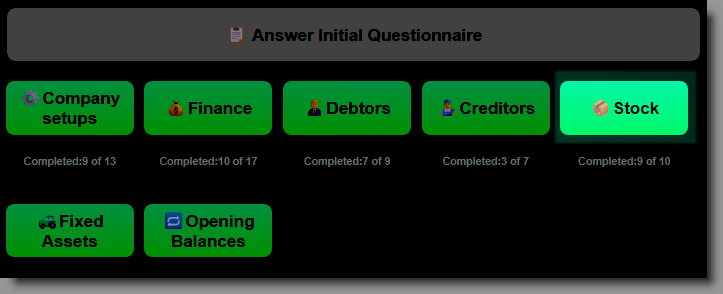
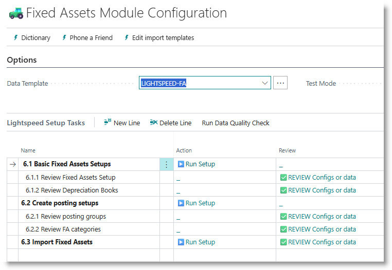
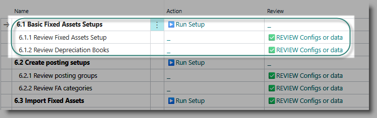
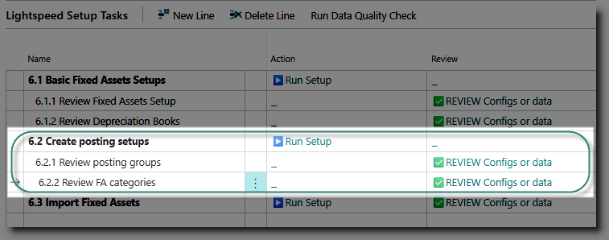
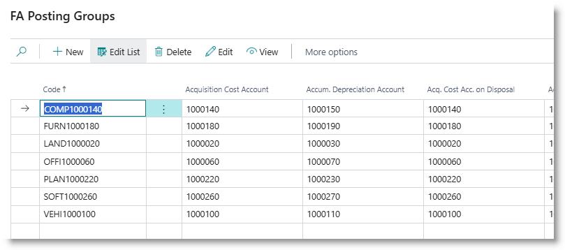
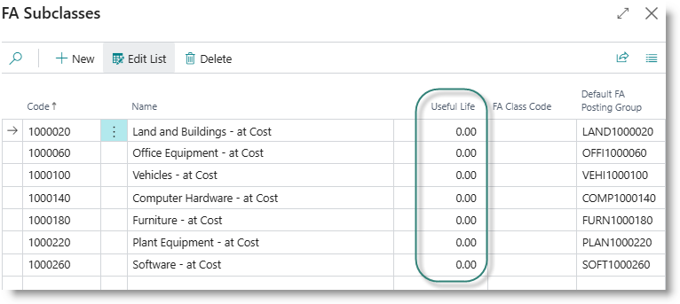
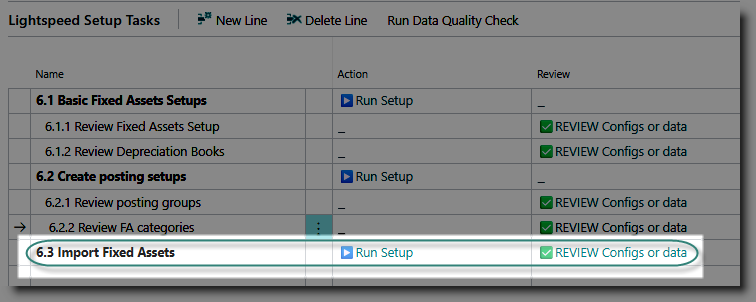
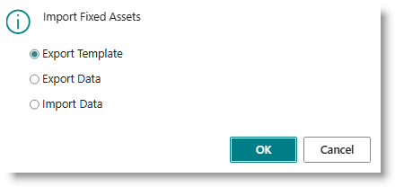
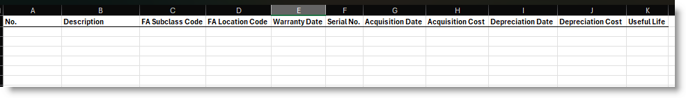

# Fixed Assets
Use this module to configure the set up the Fixed assets module of Business Central

## Basic Fixed Assets Setups
This step is compulsory and must be completed before continuing with loading the fixed assets data.

Click on '▶️Run Setup' for the task 'Basic Fixed Assets Setups'. 
This step creates the default depreciation book and updates the fixed assets setup.

Use the '✅REVIEW' action for the tasks 'Review Fixed Assets Setup' and 'Review Depreciation Books' to examine the results.

## Create Posting Setups
Thi task creates fixed asset categories and posting group, which are used to define how the fixed assets sub ledger is connected to the General Ledger accounts.

Click on '▶️Run Setup' for the task.

A posting group will be created for each GL account which has the key account usage 'FA-ATCOST'. 

After completion, click on '✅REVIEW' for the task 'Review Posting Groups'. Each posting group links the fixed asset category to the following GL accounts:
- Fixed assets at cost 
- Accumulated depreciation
- Gains / losses on disposal
- Maintenance
- Depreciation expense

Click on '✅REVIEW' for the task 'Review FA Categories'. The setup task creates a category for each GL account which has the key account usage 'FA-ATCOST'. You can add or edit the list if required.

>It's good practice to add the default useful life to each category, to simplify the process of creating a new asset.

## Load Fixed Assets Master and Balances
The final step, 'Import Fixed Assets', will create the FA master information, and take on the assets' acquisition cost and accumulated depreciation.

Click on '▶️Run Setup' for the task. 

Click on Export Template, then OK. Open the sheet:

Columns A to F must be populated with the fixed asset master information:

        Fixed Asset number
        Description
        Class code (category)
        Location code (optional)
        Warranty date (optional)
        Serial No. (optional)

Columns G to K are used to record the financial details of the asset:

        Acquisition Date: the date on which the asset was acquired by the business.
        Acquisition Cost: the original purchase cost of the asset
        Depreciation date: the last date at which the asset was depreciated
        Depreciation cost: accumulated depreciation as at the depreciation date
        Useful life: the total length in months that the asset is depreciated over.

After preparing and saving the spreadsheet, click again on '▶️Run Setup', and this time, select 'Import Data'. For each asset on the sheet, the process will:
- Create a new fixed asset
- Create an associated depreciation book.
- Create a FA ledger entry for the acquisition cost
- Create a FA ledger entry for the accumulated depreciation.

The result is a set of assets, with fixed asset subclass and posting group assigned, and net book value recorded in fixed assets sub ledger.

[**⬆️ Back to Top**](#initial-questionaire) &nbsp;&nbsp;&nbsp;&nbsp; [**🏠 Home**](/FastTrack-Support)