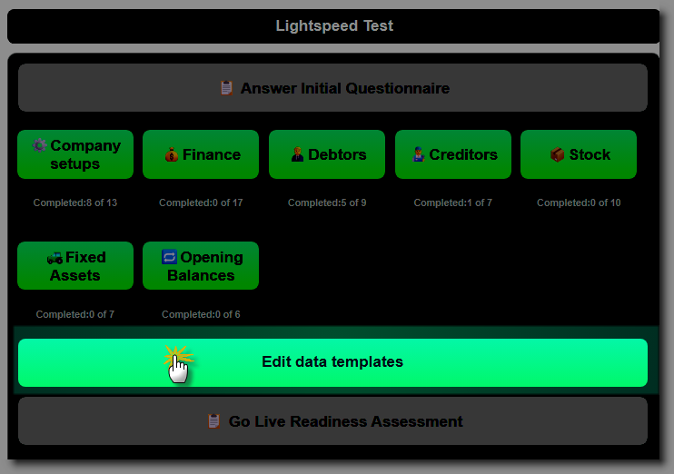
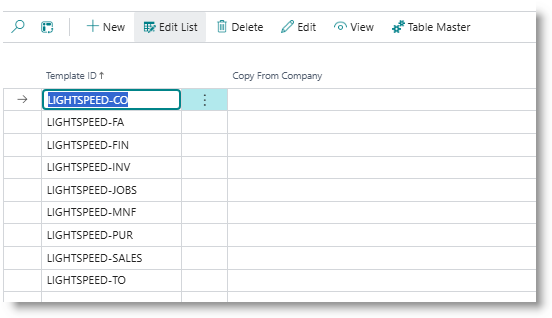
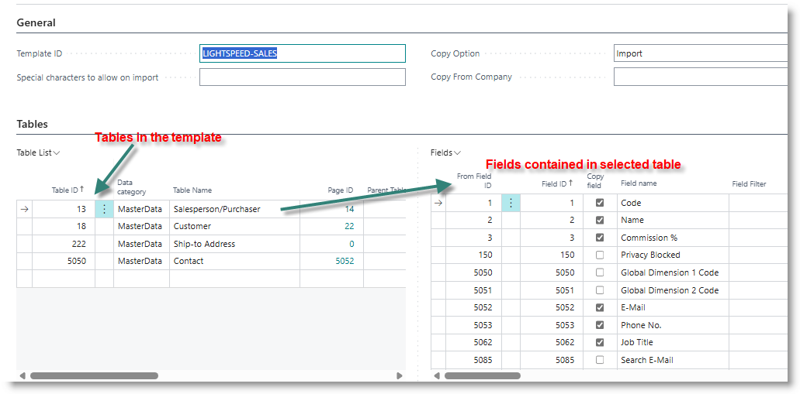
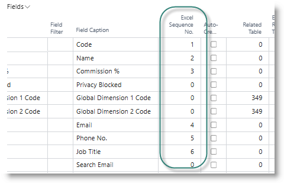
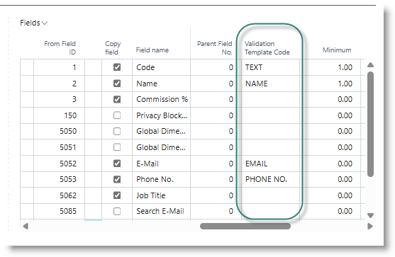
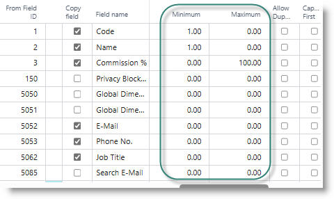

# Managing Data Templates
Data templates are used to map Excel data to Business Central tables.  

When the Lightspeed extension is installed, a number of default data templates are automatically loaded, one template per module. Each table in these templates is configured with the commonly used or essential columns required for the table. The templates can be edited, to remove or add columns as needed.The template is also used to configure basic data validation and quality checks.

Additional templates can be added for loading adhoc tables that are not catered for in the standard Lightspeed configuration.

The configuration page for each module provides access to the module-specific template. All templates are accessible from the Lightspeed home page, by clicking on 'Edit Templates':

From the list, select a template, and click on Edit:

In the example below (the Sales template), the panel of the left contains the tables configured for the template. The panel on the right contains the list of fields in the selected table (Salesperson):

The field list contains all fields contained in the table. A field can be selected / deselected by tick on the column 'Copy Field'.

Scroll to the right of the field list, until you see the column 'Excel Sequence No.'. This controls the sequence in which columns are created on the import template. In this example, the salesperson code will be in column A of the spreadsheet, the name will be in Column B and so forth.

Scroll further to the right, until you see the column'Validation Template Code'.

In the example above, the Salesperson name will be subjected to the Validation template 'NAME'. When importing data to the Salesprson/purchaser table, the name data on the spreadsheet will be stripped of special characters which are used in Business Central, such as '*', '|' and '&' (these characters are used for applying filters, and may compromise the normal functioning of Business Central).

The Email field, subject to the EMAIL template, will be stripped of all special characters, excel '-', '_' and '@'.

These validation templates can be modidfied to adjust the characters that are removed from incoming data.

Scroll again, until the fields Minimum and Maximum become visible.

For text fields, these values can be used to manage the length of a field. For numeric fields, they control the minimum allowable value, and the maximum allowable value.
In this example, the fields 'Code' and 'Name' have a mimimum length of 1. This will cause the system to report a data quality issue with records where these fields are blank. The field 'Commission %' must contain a value between 0 and 100. Since 100% may be an unrealistic commssion rate, you may choose to set it to the value appropriate in your business.

[**⬆️ Back to Top**](#initial-questionaire) &nbsp;&nbsp;&nbsp;&nbsp; [**🏠 Home**](/Lightspeed-Support)