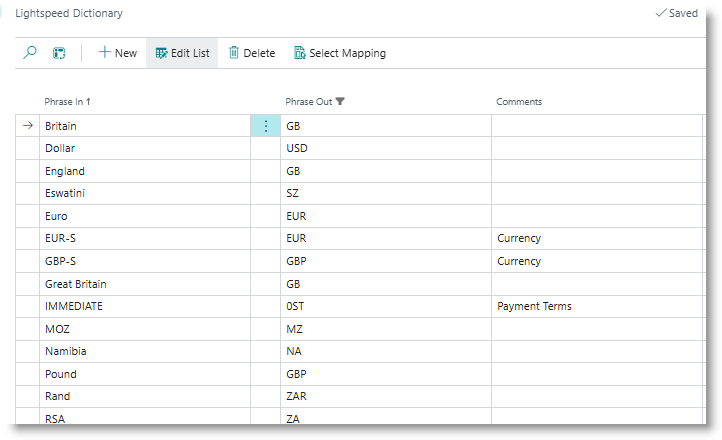

### Using the Dictionary for mapping imported data

The Dictionary allows common data errors, specifically related to system codes, to be translated from invalid values imported via Excel to be translated to the correct values. Examples include country codes or currency codes.

The Dictionary is accessible from any of the module pages.

The image above shows an example of some common data errors that may be found in incoming value, with their corrected values to be updated in the database.

- **Phrase In:** the incoming value from source data
- **Phrase Out:** the value which will be written into the database

*Example*: if the 'Britain' is found in the column for Country in imported customer data, it will be translated to the code 'GB' when the customer record is saved.