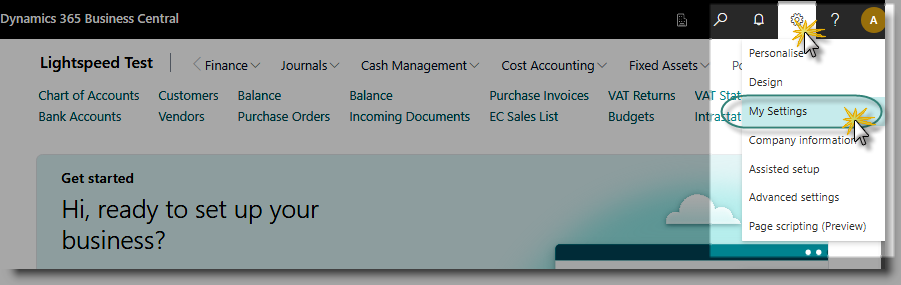
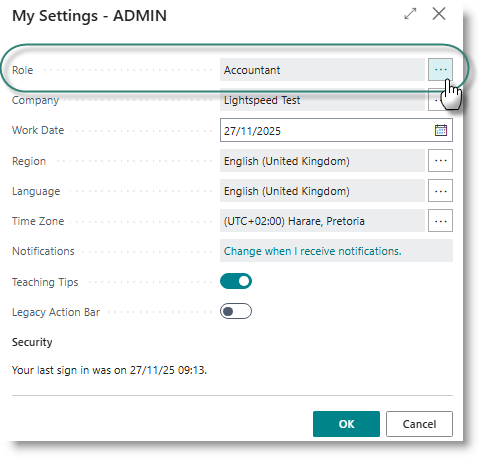
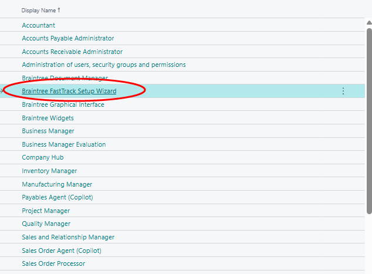

# How to change your role centre
Click on the Settings icon in the top right-hand corner. Then click on 

From the dialog, click on the (...) next to the Role setting, then select the required Role centre from the list, and click OK:

