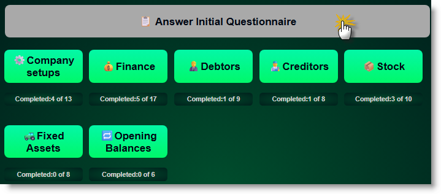
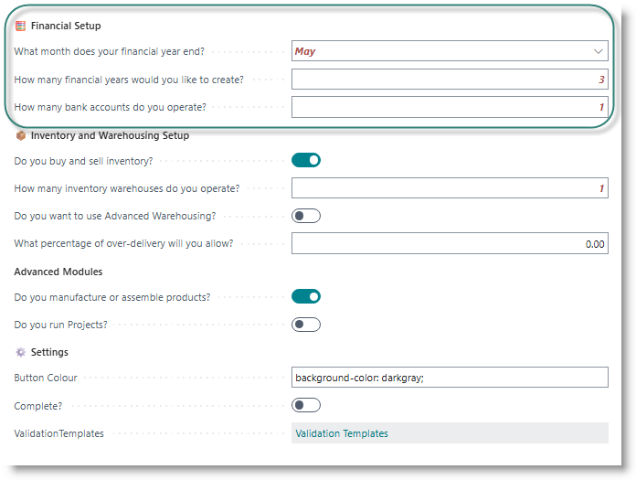
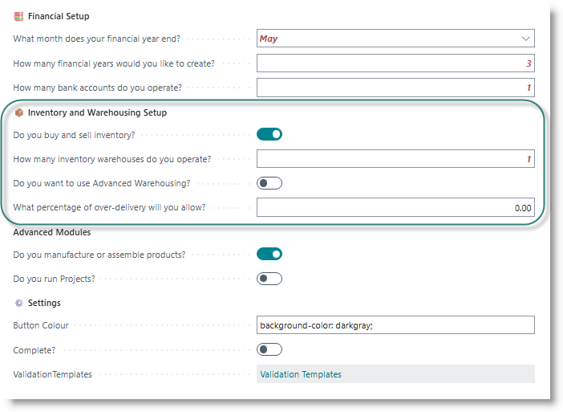

# Initial Questionnaire

- [Overview and Guidelines](#overview)
- [Financial Setups](#-financial-setup)
- [Inventory and Warehousing](#-inventory-and-warehousing-setup)
- [Advanced Modules](#-advanced-modules)
- [Validation Templates](#validation-templates)
- [Using Import Data Templates](#using-data-import-templates)
- [Using the Data dictionary](#using-data-dictionary)

## Overview
Some basic concepts to note while working through the FastTrack process:
- In general, it's a good idea to work through the modules on the home page, from left to right, top to bottom. 
- Within a module, work through the steps from top to bottom. The ‼️ symbol indicates that the step is compulsory, and that it must be done before subsequent steps can be handled.
- You can redo steps as many times as required, and return to prior steps at any point in the process.
- Try to tick off each step that applies to your business, and resolve data quality issues before you go live with Business Central.
- Make use of the Go-Live Readiness assessment to sign off the critical steps of the process, and to hold your team accountable for your preparation process.
    
The FastTrack Questionnaire is your starting point for configuring Business Central. This helps you define your business requirements and automatically configures the system based on your responses.

From the FastTrack home page, click on 'Answer initial questionnaire'.

## 🧮 Financial Setup

These settings will be used during the configuration of the Finance module of Business Central.

**What month does your financial year end?:** from the dropdown, select the month in which your financial year ends.

**How many financial years would you like to create?:** This will default to 3, but can be amended to any number of 3 or greater. The system will create financial periods for the prior year, current year nd one or more years into the future. 

**How many bank accounts do you operate?:**  Enter the number of bank accounts which your business operates.

## 📦 Inventory and Warehousing Setup
This section determines your inventory management approach:

**Do you buy and sell inventory?** If the business trades with stock, turn the switch on. This will make the inventory setups available on the home screen.

**How many inventory warehouses do you operate?** Enter the number of separate physical locations where you need to manage your inventory.

>It is not compulsory to use locations to manage stock in Business Central. If your business is simple, and stock is stored in a single site, you may choose to omit locations from your configuration.

**Do you want to use Advanced Warehousing"** Activates the setups for advanced warehousing, which includes
- Pick processes
- Put-away processes
- Bin management
- Directed put-away and pick
- Cross-docking
- Warehouse zoning
  
>Consideration: Only enable Warehousing if you use complex warehouse processes.

**Over-receiving Threshold** This setting allows you to over-receive goods. For example, if you order a quantity of 500 units of a product, and you have an over-delivery percent of 10, you will be allowed to receive up to 550 units on the order, without modifying the order quantity.

## 🏭 Advanced Modules
Use this section to switch on access to configure advanced modules in Business Central.
- Manufacturing Enables manufacturing functionality including:
  - Production orders
  - Bills of materials (BOMs)
  - Work centers and machine centers
  - Routing processes
  - Production planning
- Projects Enables project management including:
  - Job costing
  - Time and material tracking
  - Project budgeting
  - Resource allocation
  - Project invoicing

## [Validation Templates](../General/DataValidation.md)
To assist in managing the quality of data which will be imported, a set of validation templates are provided. These can be amended, or new templates created, based on the data rules that apply to the business.

## [Using Data Import Templates](../General/DataTemplates.md)

## [Using the Data Dictionary](../General/Dictionary.md)

---

[**⬆️ Back to Top**](#initial-questionaire) &nbsp;&nbsp;&nbsp;&nbsp; [**🏠 Home**](/FastTrack-Support)
