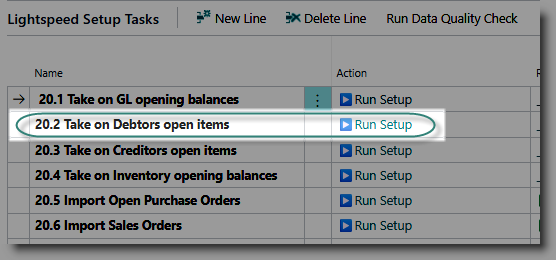
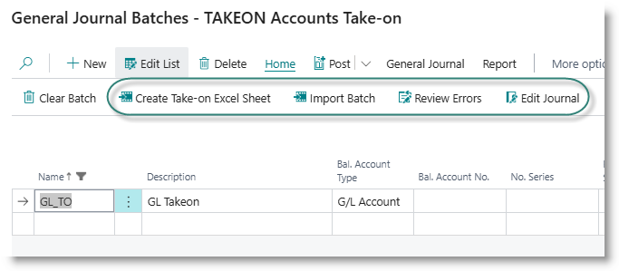
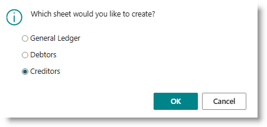
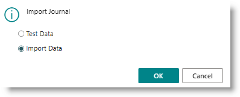
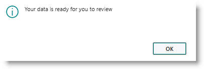
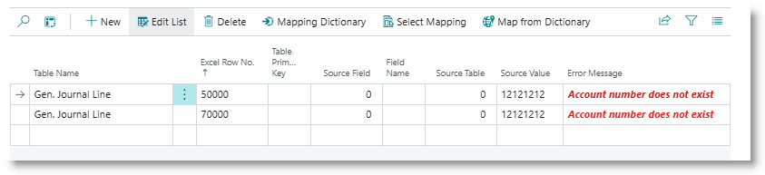

# Creditors Open Items Take-on
The creditors book can be brought on as opening balances per vendor, or open entries (transactions with an outstanding balance).

From the Opening Balances Configuration page, click on '▶️Run Setup' for the task 'Take on Creditors open items':

The TAKEON batch will open. A default batch has been created during installation. You may choose to create more batches if required.

The process is as follows:
- Create Take-on Excel Sheet, to create a template
- Populate the template
- Import the batch
- Review errors
- Edit journal and post.

**Create Take-on sheet**
Click on 'Create Take-on Excel Sheet'. From the dialog, select 'Debtors':

When the sheet has downloaded, open it and load your data as follows:

| Column                | Content |
| Account No.           | The Vendor account number |
| Posting Date          | The take-on date |
| Document Type         | Enter Invoice, Credit Memo, Payment or Refund |
| Document No.          | Enter the document number, for example invoice number |
| Description           | Optional |
| Amount                | The value of the transaction, in its source currency |
| Currency Code         | If the transaction is in a foreign currency, enter the currency code.|
| Amount (LCY)          | The value of the transaction in home currency |
| External Document No.  | The customer's document number if applicable |
| Document Date  | If the document date and posting are different, enter it here |
| Due Date  | For invoices, the date on which payment is due. |

If you are using dimensions, a column for each dimension will appear at the end of the template.

Enter one line per outstanding transaction.

**Import Data Sheet**
After you have finished preparing the spreadsheet, save and close the sheet.
On the batch list page, click 'Import Batch'. From the dialog, click on 'Import Data', then click OK:

Navigate to the folder where your take-on sheet was saved, and select it. When the import has completed, you will see the dialog :

Click OK to complete the process.

If errors occurred during the import, they will be recorded in the error log. This will typically include records with invalid account numbers or dimension codes.  Click on 'Review Errors' to display the errors:

Click on 'Edit Journal' to open the transactions. You can check or edit the entries. The import process will insert a balancing account to which the contra entry in the general ledger will be posted. This will be the one of the suspense accounts created during installation.

If you are happy with the batch, you can post the batch.

[**⬆️ Back to Top**](#debtors-open-items-take-on) &nbsp;&nbsp;&nbsp;&nbsp; [**🏠 Home**](/FastTrack-Support)
