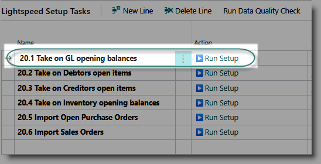
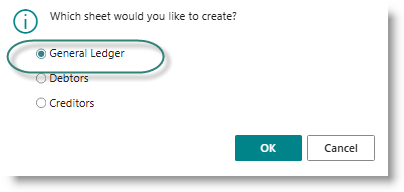

# General Opening Balances
General ledger balances should be taken on as at the chosen opening balance date. A balance must be provided for each unique combination of general ledger account number and dimension values.

From the Opening Balances Configuration page, click on '▶️Run Setup' for the task 'Take on GL opening balances:

The TAKEON batch will open. A default batch has been created during installation. You may choose to create more batches if required.

The process is as follows:
- Create Take-on Excel Sheet, to create a template
- Populate the template
- Import the batch
- Review errors
- Edit journal and post.

**Create Take-on sheet**
Click on 'Create Take-on Excel Sheet'. From the dialog, select 'General Ledger':

When the sheet has downloaded, open it and load your data as follows:

| Column                | Content |
| Account No.           | The General Ledger account number |
| Posting Date          | The take-on date |
| Document Type         | Can be left blank for GL |
| Document No.          | Use a generic document number, such as 'TAKE-ON' |
| Description           | Use a generic description |
| Amount                | The opening balance for the account |
| Currency Code         | not applicable|
| Amount (LCY)          | not applicable |
| External Document No.  | not applicable |
| Document Date  | not applicable |
| Due Date  | not applicable |

If you are using dimensions, a column for each dimension will appear at the end of the template.

Things to keep in mind:

        **The batch must balance**: the total must equal zero
        **If you are using dimensions** : there should be one line per combination of GL account number, and the various dimension values.

[**⬆️ Back to Top**](#general-opening-balances) &nbsp;&nbsp;&nbsp;&nbsp; [**🏠 Home**](/Lightspeed-Support)