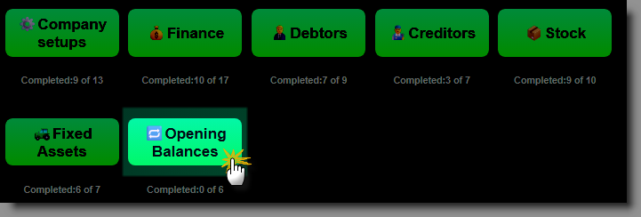
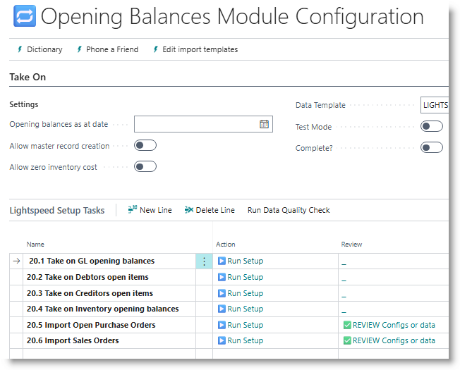
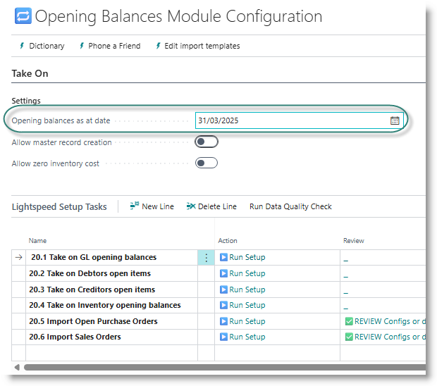

## Overview
This section deals with the process of loading opening values into the general ledger and the various subledgers with the system. Before starting the process you should already have:
- ✅ Completed configurations for all modules that you will be using
- ✅ Loaded and validated all master data
- ✅ Decided on a financial cutover date - typically at the end of a month, or the end of a financial year.

From the Home page, click on 'Opening Balances':

The take-on task list will open:

Before you begin, capture the take-on date. This should be the last day of the cut-over month:

### Suspense accounts for subledger take-on
During installation, some general ledger accounts are created to be used during the take-on of sub ledgers

### [General Ledger Opening Balances](GL.MD)

### [Debtors Open Items](Debtors.MD)

### [Creditors Open Items](Creditors.MD)

### [Inventory opening balances](Inventory.MD)

### Open Sales orders

### Open Purchase orders

[**⬆️ Back to Top**](#initial-questionaire) &nbsp;&nbsp;&nbsp;&nbsp; [**🏠 Home**](/FastTrack-Support)