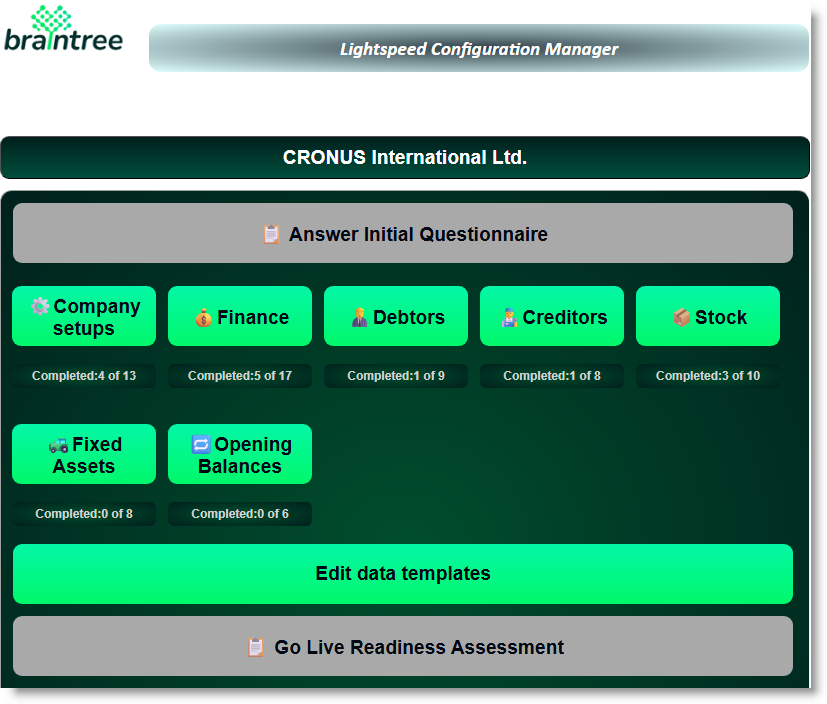

# Overview
Use the Lightspeed Configuration wizard to get up and running on Microsoft Dynamics 365 Business Central, with maximum speed and minimum fuss!

## Getting Started with Lightspeed
Follow the steps below to prepare for your Lightspeed Business Central implementation.

- Use the email link on the right 👉 to send a mail to Braintree Support, requesting assistance.
- After the Lightspeed extension has been installed into your Business Central environment, arrange a training session with your consultant.
- Follow the step by step process to a successful go-live on Business Central.

## Initial Questionaire
- [Answer some basic questions about your business to get started](Questionaire/Lightspeed-Questionnaire-User-Guide.md)

## Company Setups
Run essential company configurations

## Finance
Configure your General Ledger and and Cashbook.

## Customers 
Load customer master data and related information

## Suppliers
Load supplier master data and related information

## Inventory

## Fixed Assets

## Manufacturing

## Projects

## Take on Opening Balances
