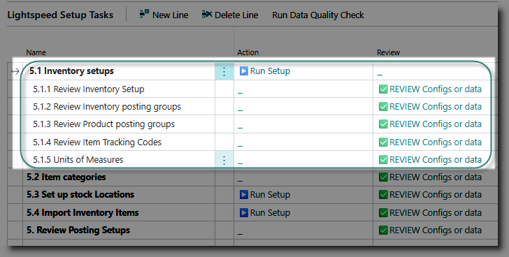

# Stock Module Configuration
Use this section to configure the Inventory module of Business Central.
Start by clicking on Stock from the Home page:

## Inventory Setups
This is a priority task, which must be done before other tasks are attempted.

Click on '▶️Run Setup' for the task 'Inventory Setups'.
This will update the Inventory setup table with commonly used settings, and assign the document number series .

It will also create Inventory Posting Groups, which are used to connect the inventory subledger to the general ledger inventory control accounts.  
A posting group will be created for each general ledger account designated with the key account usage 'INVENTORY'.

To review the Inventory setup, click on '✅REVIEW' on the task 'Review Inventory Setup'. 

To review the posting groups, click on '✅REVIEW' on the task 'Review inventory posting groups'.

After running the setups, the first inventory posting group will be inserted in the page header, in the 'Default Posting Group' field. This will be used to set the inventory posting group when importing items from Excel. You can amend this if required.

## Item Categories
Item categories are used to group inventory items for reporting purposes. It is not compulsory to use them. You may also add these to your inventory at a later stage.  If you plan to categorise your inventory, click on '✅REVIEW' for the task 'Item Categories'.

>[How to use Item Categories](https://learn.microsoft.com/en-us/dynamics365/business-central/inventory-how-categorize-items)

## Locations

## Inventory Item Master

## Posting Setups

[**⬆️ Back to Top**](#initial-questionaire) &nbsp;&nbsp;&nbsp;&nbsp; [**🏠 Home**](/Lightspeed-Support)