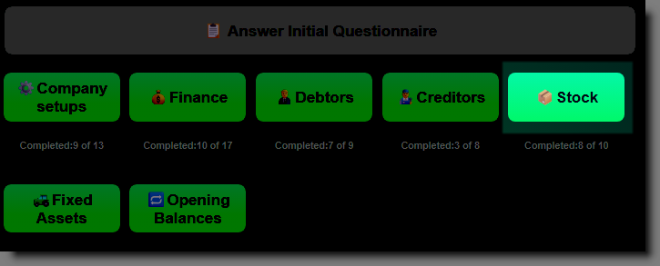
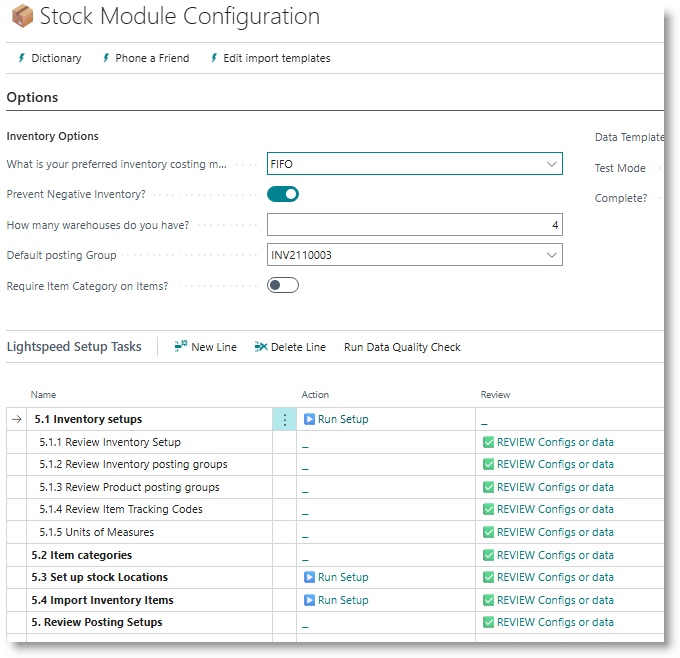
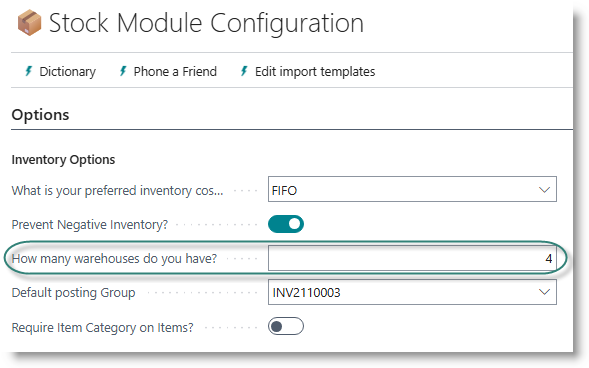
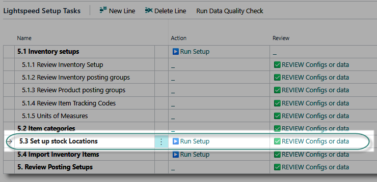
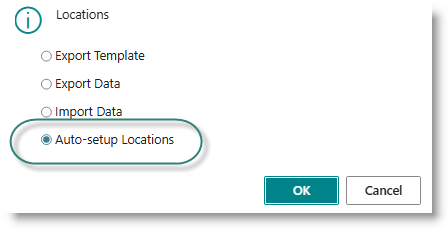
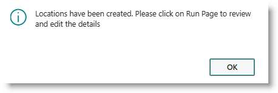
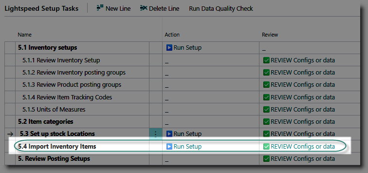
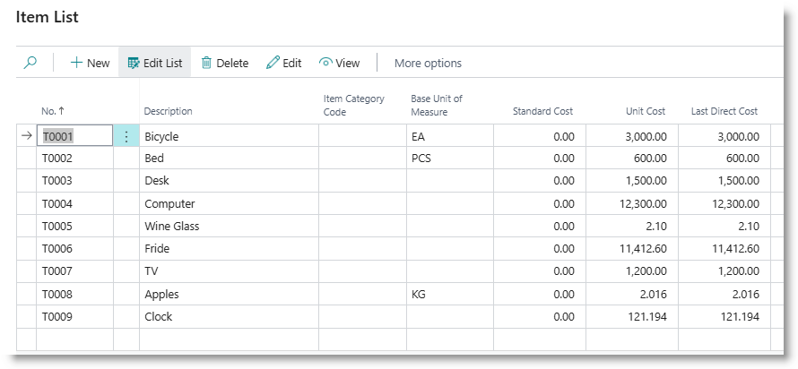
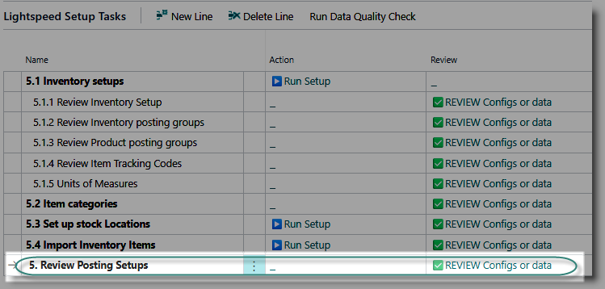
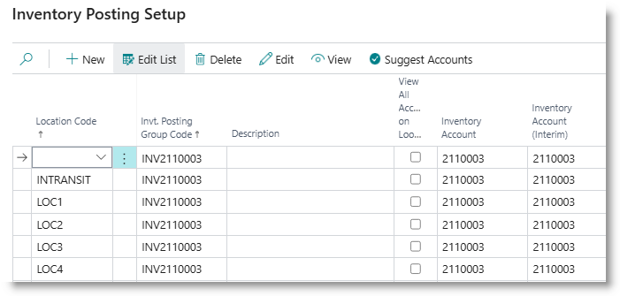

# Stock Module Configuration
Use this section to configure the Inventory module of Business Central.
Start by clicking on Stock from the Home page:

## Inventory Setups
This is a priority task, which must be done before other tasks are attempted.

Click on '▶️Run Setup' for the task 'Inventory Setups'.
This will update the Inventory setup table with commonly used settings, and assign the document number series .

It will also create Inventory Posting Groups, which are used to connect the inventory sub ledger to the general ledger inventory control accounts.  
A posting group will be created for each general ledger account designated with the key account usage 'INVENTORY'.

To review the Inventory setup, click on '✅REVIEW' on the task 'Review Inventory Setup'. 

To review the posting groups, click on '✅REVIEW' on the task 'Review inventory posting groups'.

After running the setups, the first inventory posting group will be inserted in the page header, in the 'Default Posting Group' field. This will be used to set the inventory posting group when importing items from Excel. You can amend this if required.

## Item Categories
Item categories are used to group inventory items for reporting purposes. It is not compulsory to use them. You may also add these to your inventory at a later stage.  If you plan to categorise your inventory, click on '✅REVIEW' for the task 'Item Categories'.

>[How to use Item Categories](https://learn.microsoft.com/en-us/dynamics365/business-central/inventory-how-categorize-items)

## Locations
In Business Central, physical sites where inventory is held are called 'locations'. If your business is simple, and stock is all stored in one site, you may choose not to use locations. If stock is stored in multiple sites, it is a good idea to use locations, so that stock levels can be managed per site.

Locations can be created by:
- automatically creating a specified number of locations: useful if you have a small number of sites
- import via Excel template: useful if you have a large number of locations
- manual creation.

**Autocreate locations**
Enter the number of locations you want to create in the module header:

Click on '▶️Run Setup' on the task 'Set up locations'.

From the dialog, select 'Auto-setup locations', and click on OK. The locations will be assigned codes 'LOC' + a sequential number, starting at 1.

When complete, the following dialog will appear:

**Load locations from Excel**
Click on '▶️Run Setup' on the task 'Set up locations'. From the dialog, click on 'Export Template' to create an Excel sheet. Complete the details in the sheet, save it, and then click on '▶️Run Setup' again. 
Select the option 'Import Data' and click OK. The locations will be imported.

## Inventory Item Master
Products and materials that are bought, sold or used in production are managed via Items. Before you can begin trading, you need to load your items into Business Central.

- Click on '▶️Run Setup' for the task 'Import Inventory Items'. 
- Click on 'Export Template' to create an empty Excel Sheet.
- Populate the sheet with the item information, and save the file.
- Click on '▶️Run Setup' again, and this time, select 'Import Data'.

The items will be loaded.

>[How to review data errors](../General/ErrorCorrections.md)

**Review Item Data**
To review and edit item details, click on '✅REVIEW'. The Item list will open. You can edit details on this page if required, or you can open the Item Card by clicking on the Edit action in the menu bar.

## Posting Setups
After updating locations, review the posting setups:

Click on '✅REVIEW'. The posting setup should contain an entry per combination of posting group and location, including an INTRANSIT location:

[**⬆️ Back to Top**](#initial-questionaire) &nbsp;&nbsp;&nbsp;&nbsp; [**🏠 Home**](/Lightspeed-Support)