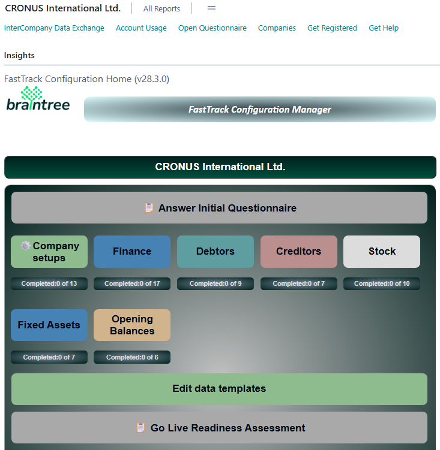

# Overview
The FastTrack Rapid Deployment process is designed to guide you through a step-by-step approach to configure a brand-new installation of Microsoft Dynamics 365 Business Central, or create a new company in an existing Business Central installation, and get your business ready up and running, with maximum speed and minimum fuss!

## Before you begin
Before starting with FastTrack, you will need :
- A Microsoft Dynamics 365 Business Central tenant configured in Microsoft's cloud.
- The FastTrack extension installed in your tenant.
- Your role centre set to 'Braintree FastTrack Setup Wizard'. &nbsp;&nbsp;
  
  >[How to change your role Centre](GettingStarted/HowToChangeRoleCentres.md)
 
If you need assistance to get to the starting line:
- Use the email link on the right 👉 to request assistance from Braintree Support.
- After the FastTrack extension has been installed into your Business Central environment, arrange a training session with your consultant.
- Follow the step by step process to a successful go-live on Business Central.

When you open Business Central, you should see the following role centre:

## Some guidelines
Before we get started, take note of the following guidelines:

#### During Configuration:
- ✅ Don't enable features unless you need them. You can add functionality later if required.
- ✅ Take the time to examine the health of your master data.

#### Next steps
- ✅ Test key processes with sample data. Your consultant can assist you in drawing up test scripts and testing plans
- ✅ Plan training for all your users to become familiar with the new system.
- ✅ Use the Go-live readiness assessment to verify that your business is ready to switch over to Business Central.

### [Get Started with the Initial Questionaire](GettingStarted/FastTrack-Questionnaire-User-Guide)

### Company-wide configurations
Run essential company configurations that form the basis of module setups.

### Finance
Configure your General Ledger and and Cashbook.

### Debtors (Sales and Receivables)
Configure the debtors and sales module. Load customer master data and related information.

### Creditors (Purchases and Payables)
Configure the creditors / purchases module. Load supplier master data and related information.

### Inventory
Configure the Stock system. Load inventory master information and related information.

### Fixed Assets
Configure the Fixed Assets module. Load fixed assets master data and opening balances.

### Manufacturing
Configure the Manufacturing module. Create bills of material, work centres and routings.

### Projects
Configure the projects module.

### Take on Opening Balances
Load opening balances for general ledger and stock. Load open items for Customers nad Suppliers.

---

[**⬆️ Back to Top**](#initial-questionaire) &nbsp;&nbsp;&nbsp;&nbsp; [**🏠 Home**](/FastTrack-Support)
